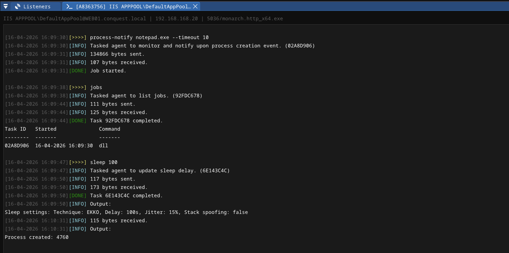

# Async BOF/COFF Loader

This asynchronous object file loader is implemented as a standalone Windows DLL in Nim. While it has been primarily created for [Conquest](https://github.com/jakobfriedl/conquest/) and its `Monarch` agent, any other post-exploitation framework with DLL loading capabilities can use `async-bof.dll` to execute Beacon Object Files in the background without blocking the main agent thread. 

Use-cases: 
- Process creation notifications
- User logon notifications
- Kerberos ticket monitoring and harvesting
- Keylogging
- ... 



## Design

In Conquest, the `async-bof.dll` is executed using the `dll` command, which loads a DLL from memory and executes a specified function in a new thread. Since the DLL is completely self-contained with an independent COFF loader and Beacon API implementation, it is able to fully execute the BOF even when sleepmask is enabled and the agents memory is encrypted.

The exported function that is run by the DLL loader has the following signature: 

```c
BOOL Run(PBYTE args, DWORD argsLen, HANDLE hWrite, HANDLE hWakeup, HANDLE hStop)
```

The `args` blob contains the raw object file bytes and the arguments passed to it in the following format.  

```
[ 4 bytes  ] Size of the object file 
[ variable ] Object file bytes
[ 4 bytes  ] Size of object file arguments
[ variable ] Object file argument bytes
 ```

The three handles it receives from the DLL loader are used to communicate with the agent. 

| Handle | Usage | 
| --- | --- | 
| **hWrite** | Pipe for output redirection. The `BeaconOutput` and `BeaconPrintf` write to this pipe whenever the APIs are invoked. On each check-in, the agent drains this pipe and prints the data in it to the agent console.
| **hWakeup** | An event used to wake up a sleeping agent. Set in the `BeaconWakeup` API, it interrupts the agents sleep delay and forces it to check-in. |
| **hStop** | An event used to stop the BOF execution using the `cancel` command from the agent console. |  

## Usage

Build the DLL: 
```
nimble dll
```

Create modules that load the `async-bof.dll` (more information [here](https://github.com/jakobfriedl/conquest/blob/main/docs/8-SCRIPTING.md)): 

```python
# -- snip -- #
bof = "/path/to/bof.o"
params = conquest.bof_pack("zz", [...])
conquest.execute_alias(agentId, cmdline, f"dll /path/to/async-bof.dll Run {conquest.async_bof_pack(bof, params)}")
# -- snip -- #
```

